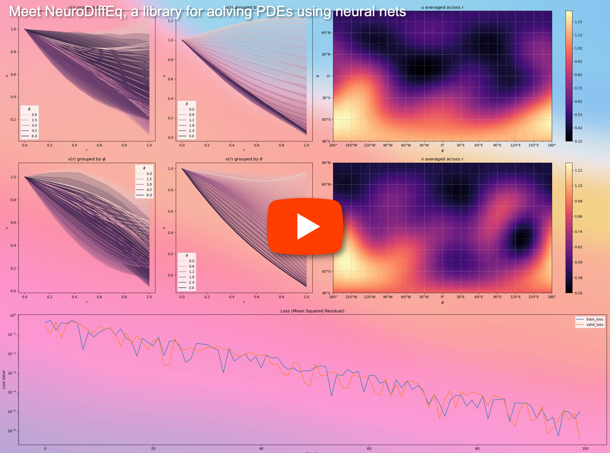

# neurodiffeq

[](https://app.codacy.com/gh/odegym/neurodiffeq?utm_source=github.com&utm_medium=referral&utm_content=odegym/neurodiffeq&utm_campaign=Badge_Grade_Settings)
  [](https://travis-ci.org/odegym/neurodiffeq) [](https://codecov.io/gh/odegym/neurodiffeq) [](https://neurodiffeq.readthedocs.io/en/latest/?badge=latest) [](https://doi.org/10.21105/joss.01931)

# Introduction

`neurodiffeq` is a package for solving differential equations with neural networks. Differential equations are equations that relate some function with its derivatives. They emerge in various scientific and engineering domains. Traditionally these problems can be solved by numerical methods (e.g. finite difference, finite element). While these methods are effective and adequate, their expressibility is limited by their function representation. It would be interesting if we can compute solutions for differential equations that are continuous and differentiable.

As universal function approximators, artificial neural networks have been shown to have the potential to solve ordinary differential equations (ODEs) and partial differential equations (PDEs) with certain initial/boundary conditions. The aim of `neurodiffeq` is to implement these existing techniques of using ANN to solve differential equations in a way that allow the software to be flexible enough to work on a wide range of user-defined problems.

<p align='center'>
  <a href='https://youtu.be/VDLwyFD-sXQ'>
    
  </a>
</p>

# Installation

## Install via pip

Like most standard libraries, `neurodiffeq` is hosted on [PyPI](https://pypi.org/project/neurodiffeq/). To install the latest stable relesase, simply use the `pip` (or `pip3`) tool.

```sh
pip install neurodiffeq 
# or try: pip3 install neurodiffeq
```

## Manual Install

Alternatively, you can install the library manually to get early access to our new features. This is the recommended way for developers who want to contribute to the library.

1. (optional) Create a new environment. With `conda`: `conda create --name [name of the new environment] python=3.7` and activate the enviroment by `conda activate  [name of the new environment]`; With `venv`: `python3 -m venv temp [path to the new environment]` and activate the environment by `source [path to the new environment]/bin/activate`
2. Clone the repo by `git clone https://github.com/odegym/neurodiffeq.git` and `cd` into the root directory of the repo by `cd neurodiffeq`
3. Install the dependencies by `pip install -r requirements.txt` and install `neurodiffeq` by `pip install .`
4. (optional) Run tests `cd tests && pytest`

1. (optional) Deactivate the environment. With `conda`: `conda deactivate`; With `venv`: `deactivate`

# Getting Started

To view complete tutorials and documentation of `neurodiffeq`, please check [Official Documentation](https://neurodiffeq.readthedocs.io/en/latest/). 

In addition to the documentations, we have recently made a quick walkthrough [Demo Video](https://youtu.be/VDLwyFD-sXQ), the slides can be found [here](https://drive.google.com/file/d/1XTbwkZ0g7ufzD7lvMB-Cl8s5nh6jKgHk/view?usp=sharing).

## Example Usages

###Imports

```python
from neurodiffeq import diff
from neurodiffeq.solvers import Solver1D, Solver2D
from neurodiffeq.monitors import Monitor1D, Monitor2D
from neurodiffeq.conditions import IVP, DirichletBVPIBVP1D, IBVP1D
from neurodiffeq.networks import FCNN, SinActv
```

### ODE System Example

Here we solve a non-linear system of two ODEs, known as the [Lotka–Volterra](https://en.wikipedia.org/wiki/Lotka–Volterra_equations) equations. There are two unknown functions (`u` and `v`) and a single independent variable (`t`).

```python
# Specify equation, returns residuals (= LHS - RHS)
def ode_system(u, v, t): # `torch.Tensor`s of shape (batch_size, 1)
    return [diff(u,t)-(u-u*v), diff(v,t)-(u*v-v)]
# Specify initial conditions; one for `u` and one for `v`
conditions = [IVP(t_0=0.0, u_0=1.5), IVP(t_0=0.0, u_0=1.0)]
# Specify nets (Optional)
nets = [FCNN(actv=SinActv), FCNN(actv=SinActv)]
# Instantiate solver, fit the networks, and get solution.
solver = Solver1D(ode_system, conditions, t_min=0.1, t_max=12.0, nets=nets)
solver.fit(max_epochs=3000)
solution = solver.get_solution()
```

`solution` is a callable object, you can pass in numpy arrays or torch tensors to it like

```python
u, v = solution(t, to_numpy=True)  # t can be np.ndarray or torch.Tensor
```

Plotting `u` and `v` against their analytical solutions yields something like:


### PDE System Example

Here we solve a Laplace Equation with Dirichlet boundary conditions on a rectangle. Note that we choose Laplace equation for its simplicity of computing analytical solution. **In practice, you can attempt any nonlinear, chaotic PDEs**, provided you tune the solver well enough.

Solving a 2-D PDE system is quite similar to solving ODEs, except there are *two* variables `x` and `y` for boundary value problems or `x` and `t` for initial boundary value problems, both of which are supported.

```python
# In general, pde_system can take multiple `u`s pde_system(u1, u2, u3, ..., x, y)
def pde_system(u, x, y):
  	source = lambda x, y: 0
	  return [diff(u, x, order=2) + diff(u, y, order=2) - source(x, y)]
# There's only one function `u`, so we only have one condition.
conditions = [
  	DirichletBVP2D(
    		x_min=0, x_min_val=lambda y: torch.sin(np.pi*y),  # Left Side
        x_max=1, x_max_val=lambda y: 0,                   # Right Side
        y_min=0, y_min_val=lambda x: 0,                   # Lower Side
        y_max=1, y_max_val=lambda x: 0,                   # Upper Side
    )
]
# Also, there's only one network
nets = [FCNN(n_input_units=2, n_output_units=1, hidden_units=(512,))]
# A monitor helps visualize solution & loss history during training
monitor_cb=Monitor2D(check_every=10, xy_min=(0, 0), xy_max=(1, 1)).to_callback()
# Instantiate solver, fit the networks, and get solution.
solver = Solver2D(pde_system, conditions, xy_min=(0, 0), xy_max=(1, 1), nets=nets)
solver.fit(max_epochs=2000, callbacks=[monitor_cb])
solution = solver.get_solution()
```

The signature of `solution` for a 2D PDE is slightly different from that of an ODE. Again, it takes in either numpy arrays or torch tensors.

```python
u = solution(x, y, to_numpy=True)
```
Evaluation u on points meshgrids in `[0,1] × [0,1]` yields the following plots

|                 ANN-Based Solution                  |           Error against Analytical Solution                  |
| :-------------------------------------------------: | :----------------------------------------------------------: |
|  |                 |

# Contributing

Everyone is welcome to contribute to this project.

When contributing to this repository, we consider the following process:

1. Open an issue to discuss the change you are planning to make.
2. Go through [Contribution Guidelines](CONTRIBUTING.md).
3. Make the change on a forked repository and update the README.md if changes are made to the interface.
4. Open a pull request.
