# neurodiffeq

[](https://pepy.tech/project/neurodiffeq)
[](https://app.codacy.com/gh/odegym/neurodiffeq?utm_source=github.com&utm_medium=referral&utm_content=odegym/neurodiffeq&utm_campaign=Badge_Grade_Settings)
  [](https://app.travis-ci.com/NeuroDiffGym/neurodiffeq) [](https://codecov.io/gh/NeuroDiffGym/neurodiffeq) [](https://neurodiffeq.readthedocs.io/en/latest/?badge=latest) [](https://doi.org/10.21105/joss.01931)

# Citation

```
@article{chen2020neurodiffeq,
  title={NeuroDiffEq: A Python package for solving differential equations with neural networks},
  author={Chen, Feiyu and Sondak, David and Protopapas, Pavlos and Mattheakis, Marios and Liu, Shuheng and Agarwal, Devansh and Di Giovanni, Marco},
  journal={Journal of Open Source Software},
  volume={5},
  number={46},
  pages={1931},
  year={2020}
}
```

------

**🔥🔥🔥Did you know that neurodiffeq supports solution bundles and can be used to solve reverse problems? [See here](#Solution Bundle and Reverse Problems)!**

:mortar_board: **Already familiar with neurodiffeq?** :point_down: **[Jump to FAQs](#faq).**

------

# Introduction

`neurodiffeq` is a package for solving differential equations with neural networks. Differential equations are equations that relate some function with its derivatives. They emerge in various scientific and engineering domains. Traditionally these problems can be solved by numerical methods (e.g. finite difference, finite element). While these methods are effective and adequate, their expressibility is limited by their function representation. It would be interesting if we can compute solutions for differential equations that are continuous and differentiable.

As universal function approximators, artificial neural networks have been shown to have the potential to solve ordinary differential equations (ODEs) and partial differential equations (PDEs) with certain initial/boundary conditions. The aim of `neurodiffeq` is to implement these existing techniques of using ANN to solve differential equations in a way that allow the software to be flexible enough to work on a wide range of user-defined problems.

<p align='center'>
  <a href='https://youtu.be/VDLwyFD-sXQ'>
    
  </a>
</p>

# Installation

## Using pip

Like most standard libraries, `neurodiffeq` is hosted on [PyPI](https://pypi.org/project/neurodiffeq/). To install the latest stable relesase, 

```bash
pip install -U neurodiffeq  # '-U' means update to latest version
```

## Manually

Alternatively, you can install the library manually to get early access to our new features. This is the recommended way for developers who want to contribute to the library.

```bash
git clone https://github.com/NeuroDiffGym/neurodiffeq.git
cd neurodiffeq && pip install -r requirements
pip install .  # To make changes to the library, use `pip install -e .`
pytest tests/  # Run tests. Optional.
```

# Getting Started

We are happy to help you with any questions. In the meantime, you can checkout the [FAQs](#faq).

To view complete tutorials and documentation of `neurodiffeq`, please check [Official Documentation](https://neurodiffeq.readthedocs.io/en/latest/). 

In addition to the documentations, we have recently made a quick walkthrough [Demo Video](https://youtu.be/VDLwyFD-sXQ) with [slides](https://drive.google.com/file/d/1XTbwkZ0g7ufzD7lvMB-Cl8s5nh6jKgHk/view?usp=sharing).

## Example Usages

### Imports

```python
from neurodiffeq import diff
from neurodiffeq.solvers import Solver1D, Solver2D
from neurodiffeq.conditions import IVP, DirichletBVP2D
from neurodiffeq.networks import FCNN, SinActv
```

### ODE System Example

Here we solve a non-linear system of two ODEs, known as the [Lotka–Volterra](https://en.wikipedia.org/wiki/Lotka–Volterra_equations) equations. There are two unknown functions (`u` and `v`) and a single independent variable (`t`).

```python
def ode_system(u, v, t): 
    return [diff(u,t)-(u-u*v), diff(v,t)-(u*v-v)]

conditions = [IVP(t_0=0.0, u_0=1.5), IVP(t_0=0.0, u_0=1.0)]
nets = [FCNN(actv=SinActv), FCNN(actv=SinActv)]

solver = Solver1D(ode_system, conditions, t_min=0.1, t_max=12.0, nets=nets)
solver.fit(max_epochs=3000)
solution = solver.get_solution()
```

`solution` is a callable object, you can pass in numpy arrays or torch tensors to it like

```python
u, v = solution(t, to_numpy=True)  # t can be np.ndarray or torch.Tensor
```

Plotting `u` and `v` against their analytical solutions yields something like:

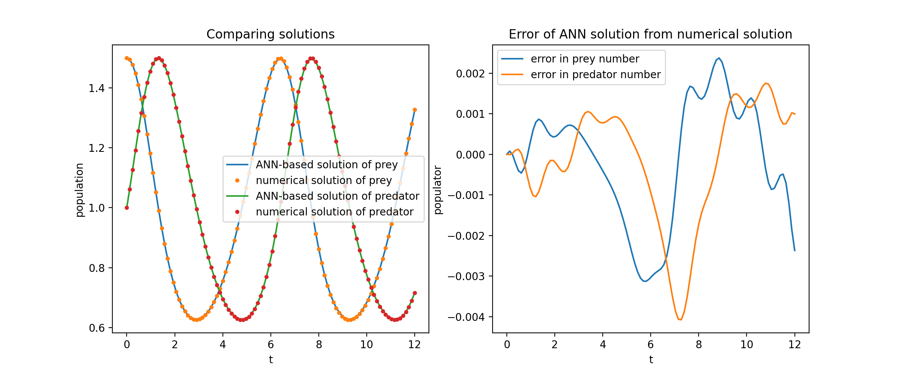

### PDE System Example

Here we solve a Laplace Equation with Dirichlet boundary conditions on a rectangle. Note that we choose Laplace equation for its simplicity of computing analytical solution. **In practice, you can attempt any nonlinear, chaotic PDEs**, provided you tune the solver well enough.

Solving a 2-D PDE system is quite similar to solving ODEs, except there are *two* variables `x` and `y` for boundary value problems or `x` and `t` for initial boundary value problems, both of which are supported.

```python
def pde_system(u, x, y):
    return [diff(u, x, order=2) + diff(u, y, order=2)]

conditions = [
    DirichletBVP2D(
        x_min=0, x_min_val=lambda y: torch.sin(np.pi*y),
        x_max=1, x_max_val=lambda y: 0,                   
        y_min=0, y_min_val=lambda x: 0,                   
        y_max=1, y_max_val=lambda x: 0,                   
    )
]
nets = [FCNN(n_input_units=2, n_output_units=1, hidden_units=(512,))]

solver = Solver2D(pde_system, conditions, xy_min=(0, 0), xy_max=(1, 1), nets=nets)
solver.fit(max_epochs=2000)
solution = solver.get_solution()
```

The signature of `solution` for a 2D PDE is slightly different from that of an ODE. Again, it takes in either numpy arrays or torch tensors.

```python
u = solution(x, y, to_numpy=True)
```
Evaluating u on `[0,1] × [0,1]` yields the following plots

|                 ANN-Based Solution                  |                    Residual of PDE                           |
| :-------------------------------------------------: | :----------------------------------------------------------: |
| 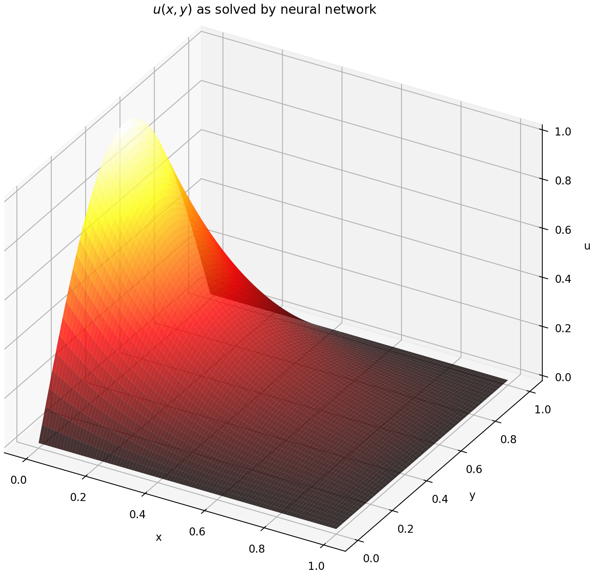 | 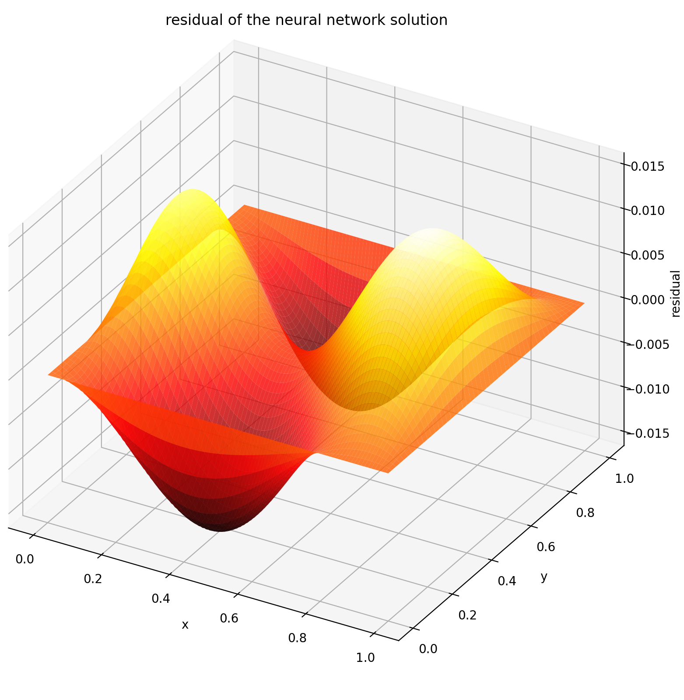                |

### Using a Monitor

A monitor is a tool for visualizing PDE/ODE solutions as well as history of loss and custom metrics during training. Jupyter Notebooks users need to run the `%matplotlib notebook` magic. For Jupyter Lab users, try `%matplotlib widget`. 

```python
from neurodiffeq.monitors import Monitor1D
...
monitor = Monitor1D(t_min=0.0, t_max=12.0, check_every=100)
solver.fit(..., callbacks=[monitor.to_callback()])
```

You should see the plots update *every 100 epoch* as well as *on the last epoch*, showing two plots — one for solution visualization on the interval `[0,12]` and the other for loss history (training and validation). 


### Custom Networks

For convenience, we have implemented an `FCNN` – fully-connected neural network, whose hidden units and activation functions can be customized. 

```python
from neurodiffeq.networks import FCNN
# Default: n_input_units=1, n_output_units=1, hidden_units=[32, 32], activation=torch.nn.Tanh
net1 = FCNN(n_input_units=..., n_output_units=..., hidden_units=[..., ..., ...], activation=...) 
...
nets = [net1, net2, ...]
```

`FCNN` is usually a good starting point. For advanced users, solvers are compatible with any custom `torch.nn.Module`. The only constraints are:

1. The modules takes in a tensor of shape `(None, n_coords)` and the outputs a tensor of shape `(None, 1)`. 

2. There must be a total of `n_funcs` modules in `nets` to be passed to `solver = Solver(..., nets=nets)`.

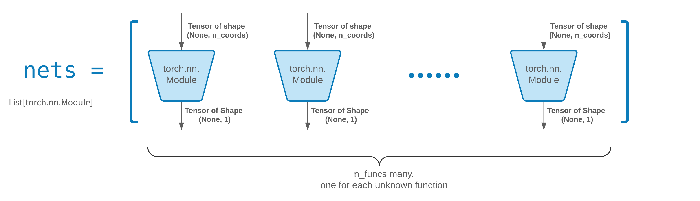

*Acutally, `neurodiffeq` has a **single_net** feature that doesn't obey the above rules, which won't be covered here.*

Read the PyTorch [tutorial](https://pytorch.org/docs/stable/notes/modules.html) on building your own network (a.k.a module) architecture. 

### Transfer Learning

Transfer learning is easily done by serializing `old_solver.nets` (a list of torch modules) to disk and then loading them and passing to a new solver:

```python
old_solver.fit(max_epochs=...)
# ... dump `old_solver.nets` to disk

# ... load the networks from disk, store them in some `loaded_nets` variable
new_solver = Solver(..., nets=loaded_nets)
new_solver.fit(max_epochs=...)
```

We currently working on wrapper functions to save/load networks and other internal variables of Solvers. In the meantime, you can read the PyTorch [tutorial](https://pytorch.org/tutorials/beginner/saving_loading_models.html) on saving and loading your networks.

### Sampling Strategies

In neurodiffeq, the networks are trained by minimizing loss (ODE/PDE residuals) evaluated on a set of points in the domain. The points are randonly resampled every time. To control the number, distribution, and bounding domain of sampled points, you can specify your own training/valiadation `generator`s.

```python
from neurodiffeq.generators import Generator1D

# Default t_min=0.0, t_max=1.0, method='uniform', noise_std=None
g1 = Generator1D(size=..., t_min=..., t_max=..., method=..., noise_std=...)
g2 = Generator1D(size=..., t_min=..., t_max=..., method=..., noise_std=...)

solver = Solver1D(..., train_generator=g1, valid_generator=g2)
```

Here are  some sample distributions of a `Generator1D`.

|      `Generator1D(8192, 0.0, 1.0, method='uniform')`      | `Generator1D(8192, -1.0, 0.0, method='log-spaced-noisy', noise_std=1e-3)` |
| :-------------------------------------------------------: | :----------------------------------------------------------: |
| 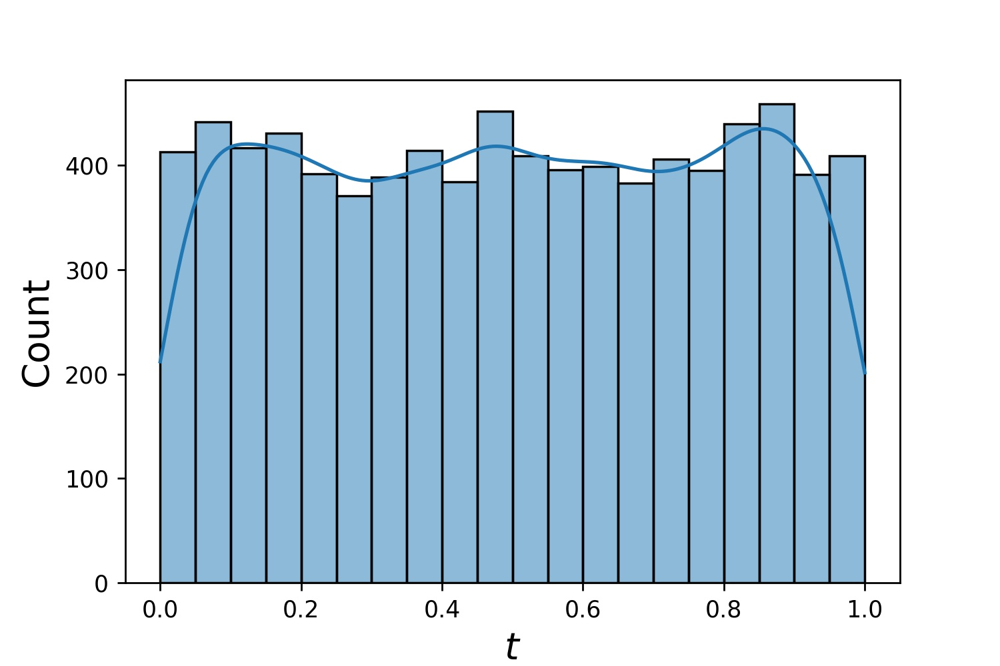 | 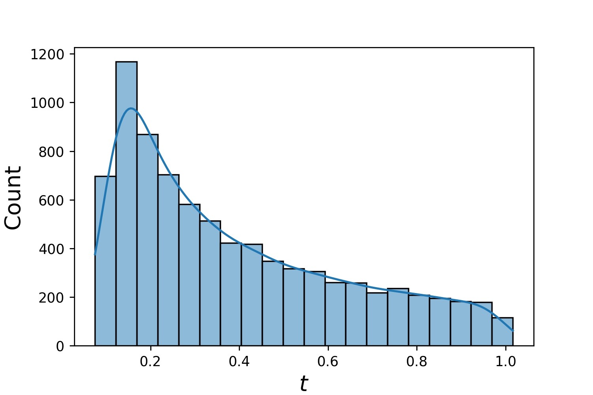 |


Note that when both `train_generator` and `valid_generator` are specified, `t_min` and `t_max` can be omitted in `Solver1D(...)`. In fact, even if you pass `t_min`, `t_max`, `train_generator`, `valid_generator` together, the `t_min` and `t_max` will still be ignored.

#### Combining Generators

Another nice feature of the generators is that you can concatenate them, for example 

```python
g1 = Generator2D((16, 16), xy_min=(0, 0), xy_max=(1, 1))
g2 = Generator2D((16, 16), xy_min=(1, 1), xy_max=(2, 2))
g = g1 + g2
```

Here, `g` will be a generator that outputs the combined samples of `g1` and `g2`

|                     `g1`                      |                     `g2`                      |                        `g1 + g2`                        |
| :-------------------------------------------: | :-------------------------------------------: | :-----------------------------------------------------: |
| 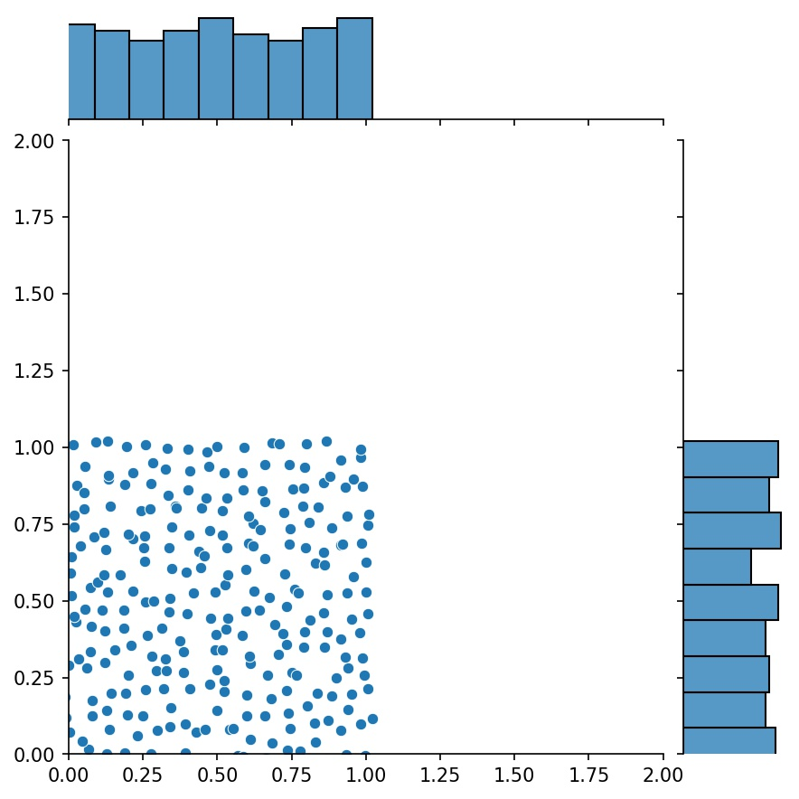 | 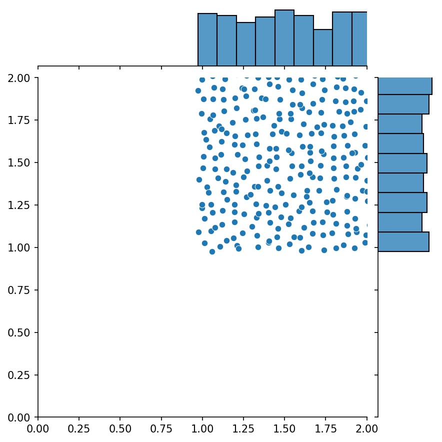 | 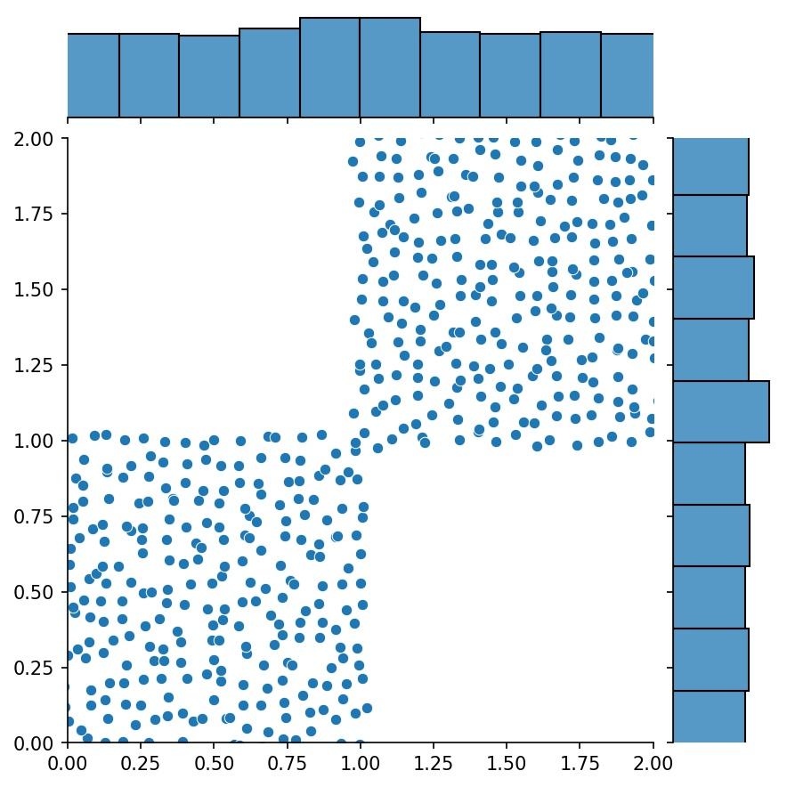 |

#### Sampling Higher Dimensions

You can use `Generator2D`, `Generator3D`, etc. for sampling points in higher dimensions. But there's also another way

```python
g1 = Generator1D(1024, 2.0, 3.0, method='uniform')
g2 = Generator1D(1024, 0.1, 1.0, method='log-spaced-noisy', noise_std=0.001)
g = g1 * g2
```

Here, `g` will be a generator which yields 1024 points in a 2-D rectangle `(2,3) × (0.1,1)` every time. The x-coordinates of them are drawn from `(2,3)` using strategy `uniform` and the y-coordinate drawn from `(0.1,1)` using strategy `log-spaced-noisy`.

|                      `g1`                       |                      `g2`                       |                          `g1 * g2`                           |
| :---------------------------------------------: | :---------------------------------------------: | :----------------------------------------------------------: |
| 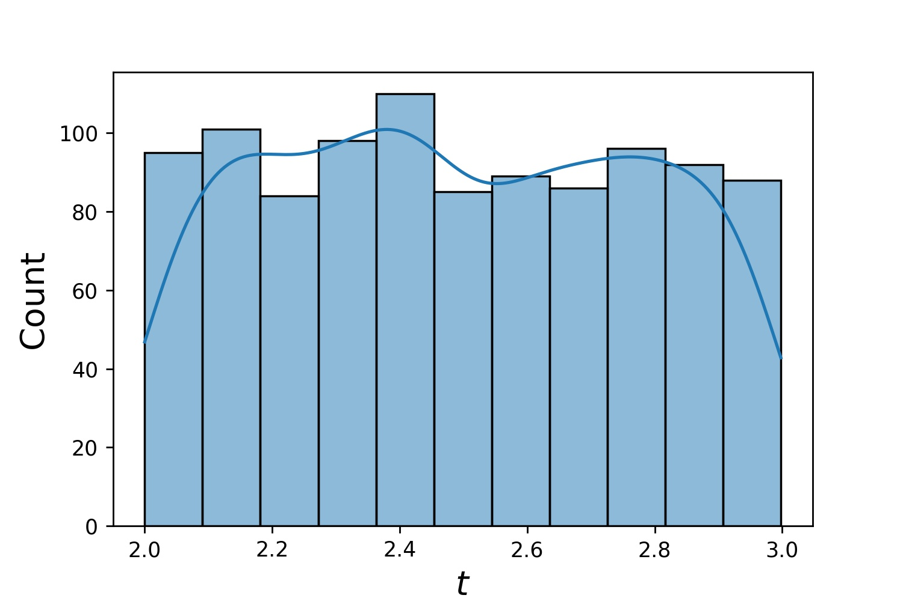 | 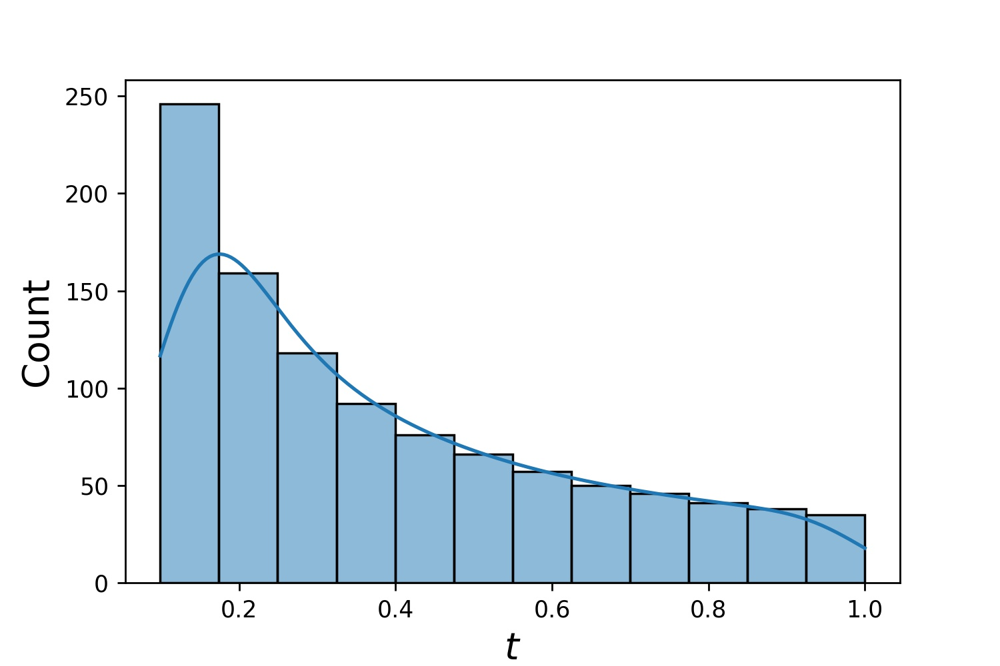 |  |

# Solution Bundle and Reverse Problems

Sometimes, it is interesting to solve a ***bundle*** of equations at once. For example, you may want to solve differential equations of the form `du/dt + λu = 0` under the initial condition `u(0) = U0`. You may want to solve this for all `λ` and `U0` at once, by treating them as inputs to the neural networks. 

One such application is for chemical reactions, where the reaction rate is unknown. Different reaction rates correspond to different solutions, and only one solution matches observed data points. You maybe interested in first solving for a bundle of solutions, and then determining the best reaction rates (aka equation parameters). The second step is known as the ***inverse problem***. 

Here's an example of how to do this using `neurodiffeq`:

1. Let's say we have an equation `du/dt + λu = 0` and initial condition `u(0) = U0` where `λ` and `U0` are unknown constants. We also have a set of observations `t_obs` and `u_obs`. We first import `BundleSolver` and `BundleIVP` which is necessary to obtaining a solution bundle:

   ```python
   from neurodiffeq.conditions import BundleIVP
   from neurodiffeq.solvers import BundleSolver1D
   
   import matplotlib.pyplot as plt
   import numpy as np
   import torch
   from neurodiffeq import diff
   ```

2. We determine the domain of input `t`, as well as the domain of parameters  `λ` and `U0`. We also need to make a decision of the order of the parameters. Namely, which should be the first parameter, and which should be the second. **For the purpose of this demo, we choose `λ` to be the first parameter (index 0), and `U0` to be the second (index 1). It is very important to keep track of the indices of the parameters.**

   ```python
   T_MIN, T_MAX = 0, 1
   LAMBDA_MIN,  LAMBDA_MAX = 3, 5  # first parameter,  index = 0
   U0_MIN, U0_MAX = 0.2, 0.6       # second parameter, index = 1
   ```

3. We then define the `conditions` and `solver` as usual, except that we use `BundleIVP` and `BundleSolver1D` instead of `IVP` and `Solver1D`. The interface of these two is very similar to `IVP` and `Solver1D`. You can find out more in the [API reference](https://neurodiffeq.readthedocs.io/en/latest/api.html). 

   ```python
   # equation parameters comes after inputs (usually temporal and spatial coordinates)
   diff_eq = lambda u, t, lmd: [diff(u, t) + lmd * u]
   
   # The keyword argument must be named "u_0" in BundleIVP. If you use anything else, e.g. `y0`, `u0`, etc., it won't work.
   conditions = [
       BundleIVP(t_0=0, u_0=None, bundle_param_lookup={'u_0': 1})   # u_0 has index 1
   ]
   
   solver = BundleSolver1D(
       ode_system=diff_eq,
       conditions=conditions,
       t_min=T_MIN, t_max=T_MAX, 
       theta_min=[LAMBDA_MIN, U0_MIN],  # λ has index 0; u_0 has index 1
       theta_max=[LAMBDA_MAX, U0_MAX],  # λ has index 0; u_0 has index 1
       eq_param_index=(0,),  					 # λ is the only equation parameter, which has index 0
       n_batches_valid=1,
   )
   ```

   Since **`λ` is a parameter in the equation** and **`U0` is a parameter in the initial condition**, we must include `λ` in the `diff_eq` and `U0` in the condition. If a parameter is present in both the equation and the condition, it must be included in both places. **All elements of `conditions` passed to `BundleSovler1D` must be `Bundle*` conditions, even if they don't have parameters.**

4. Now, we can train it and obtain the solution as we normally would. 

   ```python
   solver.fit(max_epochs=1000)
   solution = solver.get_solution(best=True)
   ```

   The solution expects three inputs - `t`, `λ` and `U0`. All inputs must have the same shape. For example, if you are interested in fixing `λ=4` and `U0=0.4` and plotting the solution `u` against `t ∈ [0,1]` , you can do the following

   ```python
   t = np.linspace(0, 1)
   lmd = 4 * np.ones_like(t)
   u0 = 0.4 * np.ones_like(t)
   
   u = solution(t, lmd, u0, to_numpy=True)
   
   import matplotlib.pyplot as plt
   plt.plot(t, u)
   ```

5. Once you have a bundled `solution`, you can find a set of parameters `(λ, U0)` that matches observed data points `(t_i, u_i)` most closely. This is achieved using simple gradient descent. In the following toy example, we assume there are only three data points `u(0.2) = 0.273`, `u(0.5)=0.129`, and `u(0.8) = 0.0609`. The following is classical PyTorch workflow.

   ```python
   # observed data points
   t_obs = torch.tensor([0.2, 0.5, 0.8]).reshape(-1, 1)
   u_obs = torch.tensor([0.273, 0.129, 0.0609]).reshape(-1, 1)
   
   # random intialization of λ and U0; keep track of their gradient
   lmd_tensor = torch.rand(1) * (LAMBDA_MAX - LAMBDA_MIN) + LAMBDA_MIN
   u0_tensor = torch.rand(1) * (U0_MAX - U0_MIN) + U0_MIN
   adam = torch.optim.Adam([lmd_tensor.requires_grad_(True), u0_tensor.requires_grad_(True)], lr=1e-2)
   
   # run gradient descent for 10000 epochs
   for _ in range(10000):
       output = solution(t_obs, lmd_tensor * torch.ones_like(t_obs), u0_tensor * torch.ones_like(t_obs))
       loss = ((output - u_obs) ** 2).mean()
       loss.backward()
       adam.step()
       adam.zero_grad()
      
   print(f"λ = {lmd_tensor.item()}, U0={u0_tensor.item()}, loss = {loss.item()}")
   ```

# FAQ

#### Q: How to use GPU for training?

Simple. When importing neurodiffeq, the library automatically detects if CUDA is available on your machine. Since the library is based on PyTorch, it will set default tensor type to `torch.cuda.DoubleTensor` for if a compatible GPU device is found.

#### Q: How to use pretrained nets?

Refer to Sections [Custom Networks](#custom-networks) and [Transfer Learning](#transfer-learning).

#### Q: How to change the learning rate?

The standard PyTorch way. 

1. Build your networks as explained in [Custom Networks](#custom-networks): `nets = [FCNN(), FCN(), ...]`

2. Instantiate a custom optimizer and pass all parameters of these networks to it

   ```python
   parameters = [p for net in nets for p in net.parameters()]  # list of paramters of all networks
   MY_LEARNING_RATE = 5e-3
   optimizer = torch.optim.Adam(parameters, lr=MY_LEARNING_RATE, ...)
   ```

3. Pass BOTH your `nets ` and your `optimizer` to the solver: `solver = Solver1D(..., nets=nets, optimizer=optimizer)`

#### Q: I got a bad solution.

Unlike traditional numerial methods (FEM, FVM, etc.), the NN-based solution requires some hypertuning. The library offers the utmost flexibility to try any combination of hyperparameters.

- To use a different network architecture, you can pass in your custom `torch.nn.Module`s.
- To use a different optimizer, you can pass in your own optimizer to `solver = Solver(..., optimizer=my_optim)`. 
- To use a different sampling distribution, you can use [built-in generators](https://neurodiffeq.readthedocs.io/en/latest/api.html#module-neurodiffeq.generators) or write your own generators from scratch.
- To use a different sampling size, you can tweak the generators or change `solver = Solver(..., n_batches_train)`.
- To dynamically change hyperparameters during training, checkout our [callbacks](https://neurodiffeq.readthedocs.io/en/latest/api.html#module-neurodiffeq.callbacks) feature.

#### Q: Any rules of thumbs?

- Don't use `ReLU` for activation, because its second-order derivative is identically 0.
- Re-scale your PDE/ODE in dimensionless form, preferably make everything range in `[0,1]`. Working with a domain like `[0,1000000]` is prone to failure because **a)** PyTorch initializes the modules weights to be relatively small and **b)** most activation functions (like Sigmoid, Tanh, Swish) are most nonlinear near 0.
- If your PDE/ODE is too complicated, consider trying curriculum learning. Start training your networks on a smaller domain, and then gradually expand until the whole domain is covered.

# Contributing

Everyone is welcome to contribute to this project.

When contributing to this repository, we consider the following process:

1. Open an issue to discuss the change you are planning to make.
2. Go through [Contribution Guidelines](CONTRIBUTING.md).
3. Make the change on a forked repository and update the README.md if changes are made to the interface.
4. Open a pull request. 

