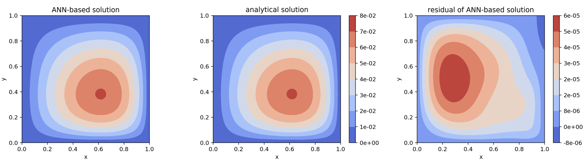

# Summary

Differential equations emerge in various scientific and engineering domains for modeling physical phenomena.  Most
differential equations of practical interest are analytically intractable.  Traditionally, differential equations are solved
by numerical methods.  Sophistical algorithms exist to integrate differential equations in time and space.  Time integration
techniques continue to be an active area of research and include backward difference formulas and Runge-Kutta methods.
Common spatial discretization approaches include the finite difference method (FDM), finite volume method (FVM), and finite
element method (FEM) as well as spectral methods such as the Fourier-spectral method.  These classical methods have been
studied in detail and much is known about their convergence properties.  Moreover, highly optimized codes exist for solving
differential equations of practical interest with these techniques.  While these methods are efficient and well-studied,
their expressibility is limited by their function representation.  For example, piecewise linear finite element methods
represent complex dynamics as piecewise linear functions.  Mesh adaptivity can provide more fidelity for complicated physics
but terms involving higher-order derivatives are still neglected.  This difficulty can be offset to some degree by increasing
the order of the basis, but the piecewise nature of the expansion does ultimately lead to non-differentiability at element
boundaries.  Fourier-spectral methods are very high-order methods with excellent convergence properties, but they
suffer from limited expressibility near boundaries.

Artificial neural networks (ANN) are a framework of machine learning algorithms that use a collection of connected units to
learn function mappings. The most basic form of ANNs, multilayer perceptrons, have been proven to be universal function approximators 
[@hornik1989multilayer]. This suggests the possibility of using ANN to solve differential equations. Previous studies have 
demonstrated that ANNs have the potential to solve ordinary differential equations (ODEs) and partial
differential equations (PDEs) with certain initial/boundary conditions[@lagaris1998artificial]. These methods show nice
properties including (1) continuous and differentiable solutions (2) good interpolation properties (3) less memory-intensive 
(Instead of having the whole numerical solution in memory, we only need to maintain the weights of the ANN). Given the
interest in developing neural networks for solving differential equations, it would be extremely beneficial to have an
easy-to-use software package that allows researchers to quickly set up and solve problems.

``NeuroDiffEq`` is a Python package built with ``PyTorch`` that uses ANNs to solve ordinary and partial differential
equations (ODEs and PDEs).  During the release of ``NeuroDiffEq`` we discovered that two other groups had almost simultaneously
released their own software packages for solving differential equations with neural networks:  ``DeepXDE``[@lu2019deepxde]
and ``PyDEns``[@koryagin2019pydens]. Both ``DeepXDE`` and ``PyDEns`` are built on top of ``TensorFlow``. 
``DeepXDE`` has an emphasis on the wide variety of problems it can solve. It supports mixing different boundary conditions and 
solving on domains with complex geometries. ``PyDEns`` is less flexible in the range of solvable problems but provides
a more user-friendly API. This trade-off is partially determined by the way these two packages implement the solver, 
which will be discussed later.  We note that ``DeepXDE`` started development shortly before development on ``NeuroDiffEq``
began while ``PyDEns`` started development shortly after ``NeuroDiffEq``.

``NeuroDiffEq`` is designed to encourage the user to focus more on the problem domain (What is the differential equation we
need to solve? What are the initial/boundary conditions?) and at the same time allow them to dig into solution domain (What
ANN architecture and loss function should be used? What are the training hyperparameters?) when they want to.  ``NeuroDiffEq`` 
can solve a variety of canonical PDEs including the heat equation and Poisson equation in a Cartesian domain with up to two
spatial dimensions.  ``NeuroDiffEq`` can also solve arbitrary systems on nonlinear ordinary differential equations.
Currently, ``NeuroDiffEq`` is being used in a variety of research projects including to study the convergence properties of ANNs 
for solving differential equations as well as solving the equations in the field of general relativity (Schwarzchild and Kerr 
black holes). 

# Methods

The key idea of solving differential equations with ANNs is to reformulate the problem as an optimization problem in which we
minimize the residual of the differential equations.  In a very general sense, a differential equation can be expressed as
$$\mathcal{L}u - f = 0$$
where $\mathcal{L}$ is the differential operator, $u$ is the solution that we wish to find, and $f$ is a known forcing
function.  We denote the output of the neural network as $u_{N}$.  If $u_{N}$ is a solution to the differential
equation, then the residual $$\mathcal{R}\left(u_{N}\right) = \mathcal{L}u_{N} - f $$ will be identically zero.
One way to incorporate this into the training process of a neural network is to use the residual as the loss function.  In
general, the $L^{2}$ loss of the residual is used.  This is the convention that ``NeuroDiffEq`` follows, although we note
that other loss functions could be conceived.  Solving the differential equation is re-case as the following optimization
problem: 
$$
\min_{\vec{p}}\left(\mathcal{L}u_{N} - f\right)^2
$$
where $\vec{p}$ are the weights of the ANN.

## Boundary and Initial Conditions
It is necessary to inform the neural network about any boundary and initial conditions since it has no way of enforcing these *a priori*.
There are two primary ways to satisfy the boundary and initial conditions.  First, one can the initial/boundary conditions to the
loss function.  For example, given an initial condition $u\left(x,t_{0}\right) = u_{0}\left(x\right)$, the loss function can
be modified to:
$$
\min_{\vec{p}}\left[\left(\mathcal{L}u_{N} - f\right)^2 + \lambda\left(u_{N}\left(x,t_{0}\right) - u_0\left(x\right)\right)^2\right]
$$
where the second term penalizes solutions that don't satisfy the initial condition.  Larger $\lambda$ results in stricter
satisfaction of the initial condition.  However, this approach does not lead to *exact* satisfaction of the initial and
boundary conditions.

Another option is to transform the $u_{N}$ in a way such that the initial/boundary conditions are satisfied by
construction.  Given an initial condition $u_{0}\left(x\right)$ the neural network can be transformed according to:
$$
\widetilde{u} = u_{0}\left(x\right) + \left(1-e^{-\left(t-t_{0}\right)}\right)u_{N}
$$
so that when $t = t_0$, $\widetilde{u}$ will always be $u_0$. Accordingly, the objective function becomes 
$$
\min_{\vec{p}}\left(\mathcal{L}\widetilde{u} - f\right)^2.
$$

Both of these two methods have their advantages. The first way is simpler to implement and can be more easily extended to
high-dimensional PDEs and PDEs formulated on complicated domains. The second way assures that the initial/boundary conditions
are exactly satisfied.  Considering that differential equations can be sensitive to initial/boundary conditions, this is
expected to play an important role. Another advantage of the second method is that fixing these conditions can reduce the
effort required during the training of the ANN[@mcfall2009artificial]. ``DeepXDE`` uses the first way to impose initial/boundary 
conditions. ``PyDEns`` uses a variation of the second approach to impose initial/boundary conditions. ``NeuroDiffEq``, the
software described herein, employs the second approach. 

## Case Studies

Here we present two differential equations and how can they be solved by ``NeuroDiffEq``. In both cases, we are using 
a fully connected neural network with one hidden layer of 32 nodes.

### Lotka–Volterra equations

The Lotka–Volterra equations are a system of first-order, nonlinear ODEs that have been used to model predator-prey dynamics
in biological systems as well as problems in chemical kinetics.  They are given by:
$$
\begin{align}
\frac{dx(t)}{dt} &= \alpha x(t) - \beta x(t)y(t), \quad x\left(0\right) = x_{0} \\
\frac{dy(t)}{dt} &= \delta x(t)y(t) - \gamma y(t), \quad y\left(0\right) = y_{0}.
\end{align}
$$
The time-evoluation of the population of the prey and predator are given by $x$ and $y$, respectively, with $x_{0}$ and
$y_{0}$ the initial populations. The coupling parameters $\alpha$, $\beta$, $\delta$ and $\gamma$ describe the interaction of
the two species. Let $\alpha = \beta = \delta = \gamma = 1$, $x_{0} = 1.5$, and $y_{0} = 1.0$. For comparison purposes, we
solve this problem numerically with ``scipy`` and ``NeuroDiffEq``.  Figure 1 compares the predator and prey populations from
the numerical integrator and the neural network.  The solutions are qualitatively the same. 

*Figure 1: Comparing numerial and ANN-based solutions of Lotka–Volterra equations.* 

### Poisson's equation

Poisson's equation is a second-order linear PDE. It can be used to describe the potential field caused by a given charge 
or mass density distribution. In a two dimensional Cartesian coordinates, it takes the form:
$$
\left(\frac{\partial^2}{\partial x^2} + \frac{\partial^2}{\partial y^2}\right)u(x, y) = f(x, y).
$$
We solve the equation in the domain $(x, y) \in (0, 1) \times (0, 1)$ with homogeneous Dirichlet boundary conditions, 
$$
u(x, 0) = u(x, 1) = u(0, y) = u(1, y) = 0.
$$
With $f(x, y) = 2x(y-1)(y-2x+xy+2)e^{x-y}$ the analytical solution is
$$
u(x, y) = x(1-x)y(1-y)e^{x-y}.
$$
Figure 2 presents contours of the neural network solution (left), the analytical solution (middle), and the error between the
analytical and neural network solution (right).  The largest error in the neural network solution is around $6\cdot 10^{-5}$.

*Figure 2: Comparing analytical and ANN-based solutions of Poisson's equation.* 

# References
